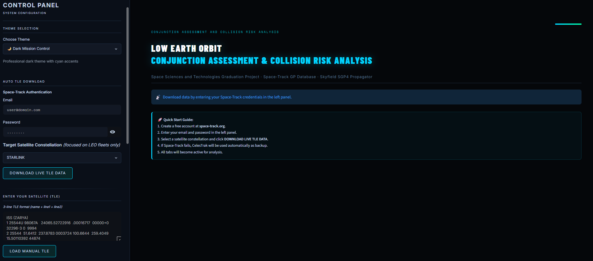

# 🌌 StarWeb-CARA: Conjunction Assessment and Collision Risk Analysis


> *A comprehensive Streamlit-based web application for analyzing conjunction events and collision risks in Low Earth Orbit (LEO).*

This system implements industry-standard algorithms for satellite collision probability assessment, including multiple Pc models, fragmentation analysis, and real-time cinematic 3D visualizations.

---

[](https://www.youtube.com/watch?v=YOUR_YOUTUBE_LINK)

## 🎓 Academic Context & Credits

### Why This Project Was Developed
This system was developed as a **Graduation Project** for the **Space Sciences and Technologies** department. With the exponential rise of low Earth orbit (LEO) satellite deployments, monitoring and mitigating orbital debris risks has become a critical challenge for modern space safety. 

The primary objective of this project is to implement, evaluate, and visualize industry-standard conjunction assessment risk analysis (CARA) methodologies specifically focusing on the operational collision risks posed by modern megaconstellations such as Starlink and OneWeb.

### 👥 Project Team
* **Author:** **ALTAY ÇAVUŞ**
    * **Role:** Lead Developer & Researcher 
    * **Department:** Space Sciences and Technologies
    * **Contact:** *altaycavuss@gmail.com*
    * **LinkedIn:** *www.linkedin.com/in/altaycavus*
* **Academic Advisor:** **Assoc. Prof. BURCU ÖZKARDEŞ**
    * **Role:** Project Supervisor / Consultant 
    * **Affiliation:** Department of Space Sciences and Technologies

---

## 🚀 Key Features & Innovations

### 1. Core Analysis Capabilities
* **Live TLE Integration**: Connects directly with the *Space-Track GP* database and *CelesTrak* (fallback) for real-time orbital data.
* **Megaconstellation Support**: Instantly loads fleets like STARLINK, ONEWEB, ISS, KUIPER, IRIDIUM-NEXT, and PLANET.
* **Custom Satellite Entry**: Inject your own 3-line TLE data to test your custom satellite against existing space infrastructure.
* **Apsis Filter (ESA/NASA Standard)**: Dramatically reduces O(N²) computational load by pre-filtering satellite pairs with non-overlapping altitude bands.

### 2. Advanced Collision Probability (Pc) Models
* **Chan (1997) Isotropic Model**: Fast closed-form approximation assuming spherical position uncertainty.
* **Foster & Estes (1992) 2D-Pc**: The ultimate industry standard. Projects uncertainties onto a 2D encounter plane and integrates the combined Gaussian probability density over the Hard-Body Radius (HBR).
* **Max-Pc Analysis**: Iterative covariance variation to find the mathematical maximum collision probability for a given geometry.
* **Mahalanobis Distance Test**: Evaluates the validity of 2D-Pc assumptions (Md < 1.5 → 3D-Pc required).

### 3. Risk Assessment & Physics
* **NASA STD-8719.14 Risk Classification**: Four-tier risk classification (CRITICAL, HIGH, MEDIUM, LOW).
* **Probability Dilution Detection**: Alerts users to "false confidence" scenarios where wide position uncertainty mathematically drops the Pc.
* **Fragmentation Probability (Pf)**: Calculates Specific Kinetic Energy ($E_c = \frac{1}{2} m_b v_{rel}^2 / m_a$) to determine if a collision would cause Catastrophic Fragmentation (Kessler Syndrome).

### 4. Cinematic 3D Visualization & Simulators
* **Live 3D Encounter Simulator**: Watch two satellites approach each other in real-time. Features a "Jump to TCA" button, precise 5-minute steps, and a dynamic HUD (Heads-Up Display) popping up at the moment of closest approach.
* **Cyberpunk Orbital Web**: Real-time rendering of the Earth using NASA's *Blue Marble* texture with atmospheric glow, equator/meridian lines, and futuristic node-based orbit trails.
* **Data Export & Radars**: 3x3 metric grids for Keplerian elements, Altitude vs. Inclination scatter plots, and one-click Excel (CSV) exports for both conjunction reports and orbital profiles.

---

## 📋 Methodology Deep-Dive

**1. Orbit Propagation (SGP4/SDP4)**
The NORAD standard SGP4 model (via the `Skyfield` Python library) calculates position vectors by accounting for gravity harmonics, atmospheric drag, and third-body effects. 

**2. TCA Detection (5-Minute Coarse Scan)**
For pairs passing the Apsis filter, Euclidean distances are calculated iteratively with strict **5-minute fixed time steps**. The global minimum in this array determines the exact **Time of Closest Approach (TCA)**.

**3. Specific Kinetic Energy & Debris**
If a collision occurs, its severity matters. The system calculates $E_c$ (J/g). If $E_c \geq 40$ J/g, it's flagged as a **Catastrophic Fragmentation**, meaning the satellite completely shatters, significantly contributing to orbital debris.

---

### Using the Tabs

**Dashboard**: Overview of conjunction events with risk metrics, apsis filter statistics, and downloadable CSV reports

**Conjunction Analysis**: Detailed review of individual conjunction events with distance profiles, collision probability model comparisons, Mahalanobis test results, and fragmentation analysis

**Your Satellite**: Analyze your own satellite's collision risk with existing fleets. Enter your TLE data in the sidebar under "2 — ENTER YOUR SATELLITE (TLE)"

**Live Simulation**: Watch real-time 3D animation of satellite encounters with Play/Stop/Speed controls and Jump to TCA functionality

**3D Orbit & Ground Track**: Visualize satellite orbits in 3D space and ground track maps

**Orbital Elements**: View Kepler orbital elements table and altitude/inclination distribution

**Methodology**: Detailed theoretical background and algorithm explanations

### Custom Satellite Analysis

To analyze your own satellite:

1. Navigate to the sidebar section "2 — ENTER YOUR SATELLITE (TLE)"
2. Enter your TLE data in the text area (3-line format: name + line1 + line2)
3. Click "LOAD MANUAL TLE"
4. Go to the "YOUR SATELLITE" tab to view conjunction analysis results

## 📚 Dependencies

- **streamlit**: Web application framework
- **pandas**: Data manipulation and analysis
- **numpy**: Numerical computing
- **plotly**: Interactive visualization library
- **skyfield**: Astronomical calculations and SGP4/SDP4 orbit propagation
- **spacetrack**: Space-Track API client
- **scipy**: Scientific computing (statistics, integration)
- **pillow**: Image processing
- **requests**: HTTP library

## 📖 References

- Foster, J.L. & Estes, H.S. (1992). A parametric analysis of orbital debris collision probability and maneuver rate for space vehicles. NASA Technical Memorandum.
- Chan, F.K. (1997). Spacecraft Collision Probability. The Aerospace Press.
- Hoots, F.R. & Roehrich, R.L. (1980). Models for Propagation of NORAD Element Sets. Spacetrack Report No. 3.
- NASA (2023). Spacecraft Conjunction Assessment and Collision Avoidance Best Practices Handbook. CARA Handbook Rev. 1.
- NASA (2011). Process for Limiting Orbital Debris. NASA-STD-8719.14A.
- Alfriend, K.T. & Akella, M.R. (2000). Probability of Collision Between Space Objects. J. Guidance, Control, and Dynamics, 23(5), 769–772.
- ESA (2011). Efficient All vs. All Collision Risk Analyses — Smart Sieve Algorithm. ISSFD Proceedings.
- Vallado, D.A. (2013). Fundamentals of Astrodynamics and Applications. 4th ed. Microcosm Press.
- Hall, D.T. et al. (2023). A Multistep Probability of Collision Computational Algorithm. NASA NTRS.

## 🔧 Technical Details

- **Orbit Propagation**: SGP4/SDP4 via Skyfield library
- **Data Source**: Space-Track GP endpoint (18th Space Defense Squadron, US Space Force)
- **Coordinate System**: ECI (Earth-Centered Inertial) for calculations, ECEF (Earth-Centered Earth-Fixed) for ground tracks
- **Time System**: UTC (Coordinated Universal Time)
- **Performance Note**: Pure Python/Skyfield produces ~1M steps/sec. For large-scale operational simulations, Rust/Zig-based libraries like Astrora (4.8–15M steps/sec with SIMD) or SatKit (~3.4M steps/sec) are recommended.


## 💻 Installation & Usage

### Prerequisites
* `Python 3.9+`
* `Git`
* [Space-Track.org](https://www.space-track.org) Account

### Setup
```bash
# 1. Clone
git clone [https://github.com/altonythecoder/StarWeb-CARA.git](https://github.com/altonythecoder/StarWeb-CARA.git)
cd StarWeb-CARA

# 2. Virtual Env
python -m venv venv
# Windows:
venv\Scripts\activate
# Mac/Linux:
source venv/bin/activate

# 3. Dependencies
pip install -r requirements.txt

# 4. Launch
streamlit run starweb-cara.py
```

## 📄 License

MIT License © 2025 Altay Çavuş

This project is open source and freely available for educational, research, and commercial use.
See [LICENSE](LICENSE) for full terms.

> **Dependencies** (Skyfield, Plotly, Streamlit, etc.) are distributed under their own respective licenses.

## 🤝 Contributing

This is an academic project. For questions, suggestions, or collaboration opportunities, please open an issue or contact the maintainers.

## ⚠️ Disclaimer

This system is provided for educational and research purposes only. Collision probability calculations are approximations and should not be used for operational collision avoidance decisions without proper validation and expert review. Always consult official conjunction assessment services for operational satellite operations.

## 📜 License & Copyright

**Copyright © 2026 Altay. All rights reserved.**

This software and its source code are proprietary. Unauthorized copying, modification, distribution, or commercial use of this file, via any medium, is strictly prohibited.

## 📧 Contact

For questions or support regarding this project, please contact the maintainers through the repository's issue tracker.

---

**Space Sciences and Technologies Graduation Project**  
*Developed with ❤️ for the space community*


